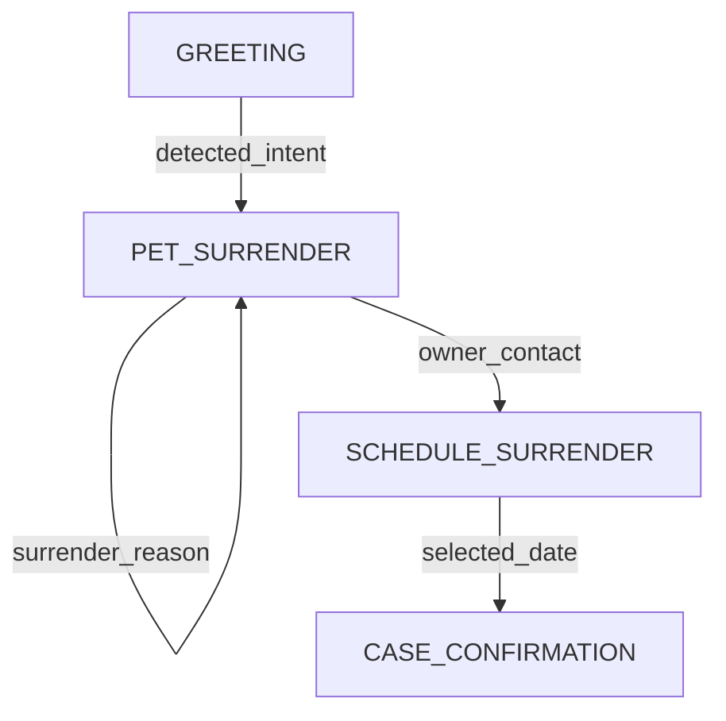

# Call Logging Setup Guide

Complete guide to set up call logging and analytics for your phone agent.

## ✅ Setup Checklist

### 1. Database Setup (5 minutes)

- [ ] Go to [Supabase Dashboard](https://supabase.com/dashboard)
- [ ] Open SQL Editor
- [ ] Copy contents of `database/schema.sql`
- [ ] Paste and execute in SQL Editor
- [ ] Verify tables created: `calls`, `state_transitions`

### 2. Environment Configuration (2 minutes)

- [ ] Copy `.env.example` to `.env`
- [ ] Add your Supabase credentials:
  ```bash
  SUPABASE_URL=https://aupkbdhnljgoqwkjyxlg.supabase.co
  SUPABASE_KEY=your_anon_key_here
  ```
- [ ] Load environment variables (or restart your app)

### 3. Install Dependencies (1 minute)

```bash
pip install --upgrade supabase websockets
```

### 4. Test the Setup (2 minutes)

Run your agent and look for:
```
✅ Call logger initialized successfully
```

Make a test call and check Supabase dashboard:
- Go to **Table Editor** → `calls`
- You should see your test call

## 📊 What Gets Logged

### Every Call Logs:
- **Session ID** - Unique identifier
- **Start/End Time** - Call timing
- **Duration** - Total seconds
- **Initial/Final State** - Where it started/ended
- **Completion Status** - completed/error/abandoned
- **Total States** - Number of states visited
- **LLM Calls** - Total API calls made
- **Tokens Used** - Total tokens consumed

### Every State Transition Logs:
- **From/To State** - State change
- **User Input** - What they said
- **Agent Response** - What you responded
- **Context Snapshot** - Full context at that moment
- **Context Updates** - What changed
- **Transition Type** - optimized/fallback/continue
- **LLM Model** - Which model was used
- **Tokens Used** - Tokens for this call
- **Processing Time** - Milliseconds taken

## 🔍 Viewing Your Data

### In Supabase Dashboard

1. **Table Editor** - Browse raw data
2. **SQL Editor** - Run custom queries
3. **Logs** - Debug connection issues

### Using Python

```python
from src.logging import CallLogger

logger = CallLogger()

# Get recent calls
calls = logger.supabase.table('calls').select('*').order('start_time', desc=True).limit(10).execute()

# Get call flow
flow = logger.get_call_flow(call_id='your-call-id')

# Generate Mermaid diagram
mermaid = logger.generate_mermaid_flow(call_id='your-call-id')
print(mermaid)
```

### Using Example Queries

```bash
cd database
python example_queries.py
```

This will show:
- Recent calls
- Call status breakdown
- Duration statistics
- Optimization effectiveness
- Top state transitions
- Most collected fields
- Detailed flow for recent call
- Mermaid diagram

## 📈 Key Metrics to Track

### Performance Metrics

**Optimization Effectiveness:**
```sql
SELECT 
    transition_type,
    COUNT(*) as transitions,
    AVG(processing_time_ms) as avg_time
FROM state_transitions
WHERE from_state != to_state
GROUP BY transition_type;
```

Expected results:
- `optimized`: ~50% faster (single LLM call)
- `fallback`: Slower (two LLM calls)

**Average Response Time:**
```sql
SELECT 
    to_state,
    AVG(processing_time_ms) as avg_ms,
    MIN(processing_time_ms) as min_ms,
    MAX(processing_time_ms) as max_ms
FROM state_transitions
GROUP BY to_state
ORDER BY avg_ms DESC;
```

### User Experience Metrics

**Completion Rate:**
```sql
SELECT 
    completion_status,
    COUNT(*) as count,
    ROUND(COUNT(*) * 100.0 / SUM(COUNT(*)) OVER(), 2) as percentage
FROM calls
GROUP BY completion_status;
```

**Average Call Duration:**
```sql
SELECT 
    AVG(duration_seconds) as avg_duration,
    MIN(duration_seconds) as min_duration,
    MAX(duration_seconds) as max_duration
FROM calls
WHERE completion_status = 'completed';
```

**Most Common Paths:**
```sql
SELECT 
    from_state,
    to_state,
    COUNT(*) as frequency
FROM state_transitions
WHERE from_state != to_state
GROUP BY from_state, to_state
ORDER BY frequency DESC
LIMIT 10;
```

### Data Collection Metrics

**Field Collection Success:**
```sql
SELECT 
    jsonb_object_keys(context_updates) as field,
    COUNT(*) as times_collected
FROM state_transitions
WHERE context_updates IS NOT NULL
GROUP BY field
ORDER BY times_collected DESC;
```

**States Requiring Multiple Attempts:**
```sql
SELECT 
    call_id,
    to_state,
    COUNT(*) as attempts
FROM state_transitions
WHERE from_state = to_state  -- Stayed in same state
GROUP BY call_id, to_state
HAVING COUNT(*) > 2
ORDER BY attempts DESC;
```

## 🎨 Visualizing Flows

### Mermaid Diagrams

The logger automatically generates Mermaid diagrams:

```python
from src.logging import CallLogger

logger = CallLogger()
mermaid = logger.generate_mermaid_flow(call_id='your-call-id')
print(mermaid)
```

Output:


### Rendering Mermaid

**In Markdown:**
Just paste the output in a markdown file between triple backticks with `mermaid` language.

**In Web App:**
Use [mermaid.js](https://mermaid.js.org/):
```html
<script src="https://cdn.jsdelivr.net/npm/mermaid/dist/mermaid.min.js"></script>
<div class="mermaid">
  <!-- Paste mermaid diagram here -->
</div>
```

**Online:**
Paste into [Mermaid Live Editor](https://mermaid.live/)

## 🚀 Next Steps

### For Frontend Dashboard

1. **Create API endpoint** to fetch call data
2. **Use Supabase JS client** for real-time updates
3. **Render Mermaid diagrams** with mermaid.js
4. **Add filters** by date, status, duration
5. **Show live calls** with real-time subscriptions

### For Advanced Analytics

1. **Export to CSV** for Excel analysis
2. **Connect to BI tools** (Metabase, Tableau)
3. **Set up alerts** for errors or long calls
4. **A/B test** different prompts
5. **Track improvements** over time

## 🐛 Troubleshooting

### Logger not initializing

**Check environment variables:**
```bash
python -c "import os; print(os.getenv('SUPABASE_URL')); print(os.getenv('SUPABASE_KEY'))"
```

**Verify Supabase connection:**
```python
from supabase import create_client
import os

url = os.getenv('SUPABASE_URL')
key = os.getenv('SUPABASE_KEY')
supabase = create_client(url, key)

# Test query
result = supabase.table('calls').select('count').execute()
print(f"Connection successful! {result}")
```

### No data appearing

**Check if logging is enabled:**
Look for this in logs:
```
📊 LOGGER: Started call <uuid>
📊 LOGGER: Logged transition GREETING → PET_SURRENDER
```

**Check Supabase logs:**
Dashboard → Logs → Postgres Logs

### Performance issues

**Add indexes** (already in schema):
```sql
CREATE INDEX idx_calls_start_time ON calls(start_time DESC);
CREATE INDEX idx_transitions_call ON state_transitions(call_id);
```

**Limit context size:**
The logger automatically filters large objects from context.

## 📚 Additional Resources

- [Supabase Docs](https://supabase.com/docs)
- [Mermaid Docs](https://mermaid.js.org/)
- [PostgreSQL JSONB](https://www.postgresql.org/docs/current/datatype-json.html)

## 🎯 Success Criteria

You'll know it's working when:
- ✅ See "Call logger initialized successfully" on startup
- ✅ Calls appear in Supabase `calls` table
- ✅ Transitions appear in `state_transitions` table
- ✅ Can generate Mermaid diagrams
- ✅ Can run analytics queries
- ✅ Can track optimization effectiveness

---

**Need help?** Check the logs for error messages or verify your Supabase credentials.
