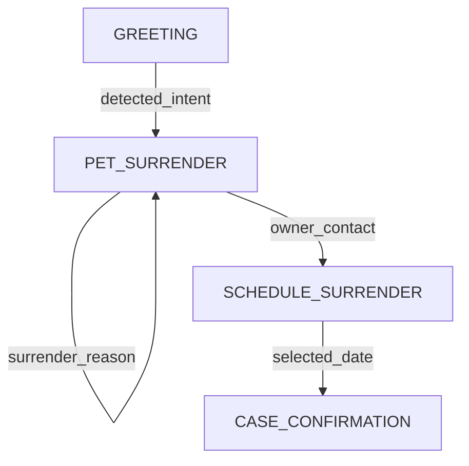

# Call Logging Database Setup

This directory contains the database schema for logging call flows and analytics.

## Setup Instructions

### 1. Create Supabase Project

1. Go to [Supabase](https://supabase.com)
2. Create a new project
3. Note your project URL and anon key

### 2. Run Schema

1. Open your Supabase project dashboard
2. Go to **SQL Editor**
3. Copy the contents of `schema.sql`
4. Paste and run in the SQL Editor

This will create:
- `calls` table - High-level call information
- `state_transitions` table - Detailed state changes and context
- `call_flows` view - Easy query for flow visualization
- Indexes for performance
- Trigger for auto-updating statistics

### 3. Configure Environment

1. Copy `.env.example` to `.env`
2. Add your Supabase credentials:

```bash
SUPABASE_URL=https://your-project.supabase.co
SUPABASE_KEY=your_anon_key_here
```

### 4. Install Dependencies

```bash
pip install supabase==2.3.0
```

### 5. Test Connection

Run your agent - you should see:

```
✅ Call logger initialized successfully
```

## Database Schema

### calls table

Stores high-level call information:

| Column | Type | Description |
|--------|------|-------------|
| call_id | UUID | Unique call identifier |
| session_id | VARCHAR | Session identifier from agent |
| start_time | TIMESTAMP | When call started |
| end_time | TIMESTAMP | When call ended |
| duration_seconds | INTEGER | Call duration |
| initial_state | VARCHAR | Starting state |
| final_state | VARCHAR | Ending state |
| completion_status | VARCHAR | completed/error/abandoned |
| total_states_visited | INTEGER | Number of unique states |
| total_llm_calls | INTEGER | Total LLM API calls |
| total_tokens_used | INTEGER | Total tokens consumed |

### state_transitions table

Stores each state change:

| Column | Type | Description |
|--------|------|-------------|
| id | BIGSERIAL | Auto-increment ID |
| call_id | UUID | Reference to calls table |
| sequence_number | INTEGER | Order within call |
| from_state | VARCHAR | Previous state |
| to_state | VARCHAR | New state |
| transition_type | VARCHAR | optimized/fallback/continue/error |
| user_input | TEXT | What user said |
| agent_response | TEXT | What agent responded |
| context_snapshot | JSONB | Full context at this moment |
| context_updates | JSONB | What changed |
| llm_model | VARCHAR | Model used |
| llm_tokens_used | INTEGER | Tokens consumed |
| processing_time_ms | INTEGER | Processing time |

## Querying Data

### Get all calls

```sql
SELECT * FROM calls ORDER BY start_time DESC LIMIT 10;
```

### Get call flow

```sql
SELECT * FROM call_flows WHERE call_id = 'your-call-id';
```

### Most common state transitions

```sql
SELECT 
    from_state, 
    to_state, 
    COUNT(*) as frequency
FROM state_transitions
GROUP BY from_state, to_state
ORDER BY frequency DESC
LIMIT 10;
```

### Average processing time by state

```sql
SELECT 
    to_state, 
    AVG(processing_time_ms) as avg_ms,
    COUNT(*) as transitions
FROM state_transitions
GROUP BY to_state
ORDER BY avg_ms DESC;
```

### Optimization effectiveness

```sql
SELECT 
    transition_type,
    COUNT(*) as count,
    AVG(processing_time_ms) as avg_time_ms
FROM state_transitions
WHERE from_state != to_state  -- Only actual transitions
GROUP BY transition_type;
```

### Context field collection frequency

```sql
SELECT 
    jsonb_object_keys(context_updates) as field,
    COUNT(*) as frequency
FROM state_transitions
WHERE context_updates IS NOT NULL
GROUP BY field
ORDER BY frequency DESC;
```

## Generating Mermaid Diagrams

Use the `CallLogger.generate_mermaid_flow()` method:

```python
from src.logging import CallLogger

logger = CallLogger()
mermaid = logger.generate_mermaid_flow(call_id='your-call-id')
print(mermaid)
```

Output:


## Performance Considerations

- **Indexes**: All key columns are indexed for fast queries
- **JSONB**: Context stored as JSONB allows flexible querying
- **Async logging**: Logger doesn't block conversation flow
- **Partitioning**: For high volume, consider partitioning by date

## Security

- **RLS enabled**: Row Level Security is enabled
- **Policies**: Default policy allows all access (customize as needed)
- **Anon key**: Safe to use in client if RLS is configured
- **Service key**: Use for admin operations only

## Troubleshooting

### Logger not initializing

Check that environment variables are set:
```bash
echo $SUPABASE_URL
echo $SUPABASE_KEY
```

### Connection errors

Verify your Supabase project is active and credentials are correct.

### Missing data

Check Supabase logs in dashboard under **Logs** → **Postgres Logs**
